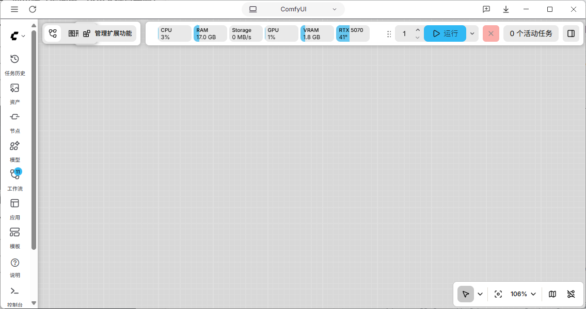
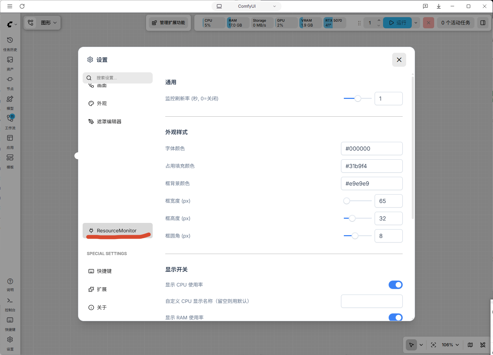

# ComfyUI-ResourceMonitor
comfy ui的一个资源监控  
直接将【ComfyUI-ResourceMonitor】文件夹放进你的【ComfyUI\custom_nodes】目录下即可  
打开comfy后，就会出现了  

这是提取的https://github.com/crystian/ComfyUI-Crystools这个大佬的改的，因为平时喜欢看个资源面板，但这个没怎么更新了，官方新版comfy用不了，就用deepseek ai弄了这个

